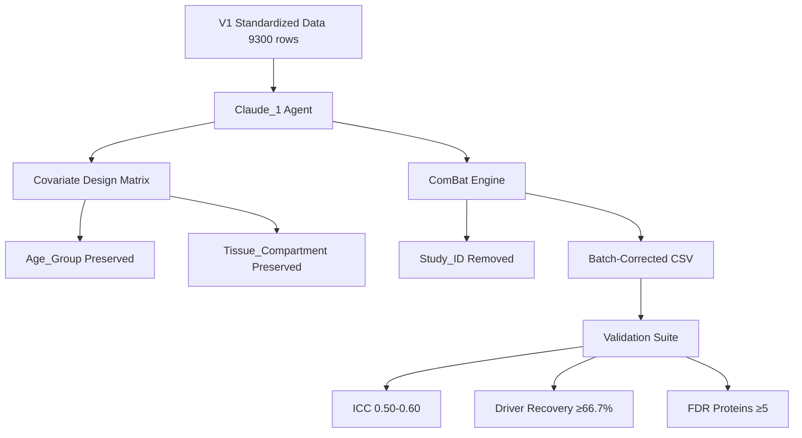
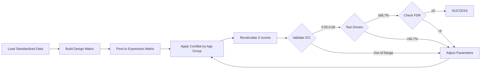

# Batch Correction V2: Claude_1 Implementation Plan

**Thesis:** Implement ComBat batch correction with Age_Group covariate preservation to achieve ICC 0.50-0.60, driver recovery ≥66.7% (8/12 proteins), and FDR-significant proteins ≥5, correcting V1's methodological flaw of removing biological signal alongside technical variance.

## Overview

V1 multi-agent experiment identified critical flaw: quantile normalization without covariate modeling removed Age_Group biological signal (0-26.7% driver recovery despite ICC 0.72-0.90). This implementation applies ComBat with design matrix preserving Age_Group and Tissue_Compartment effects while removing Study_ID batch variance. Plan covers: (1.0) technical approach with covariate matrix construction, (2.0) validation framework with incremental gates, (3.0) execution sequence, (4.0) success criteria with self-evaluation metrics.

**System Architecture (Continuants):**



**Processing Flow (Occurrents):**



---

## 1.0 Technical Approach

¶1 **Ordering principle:** Data preparation → covariate modeling → batch correction → z-score recalculation

### 1.1 Input Data

**Source:** `/14_exploratory_batch_correction/multi_agents_ver1_for_batch_cerection/claude_1/merged_ecm_aging_STANDARDIZED.csv`

**Characteristics:**
- 9,300 rows (protein observations across 11 studies)
- Log2-transformed abundance values
- Global median: 14.5 (log2 scale, target 15-30)
- Studies: 4 LINEAR→LOG2 transformed, 7 kept as-is

**Key columns:**
- `Protein_ID`, `Gene_Symbol`: Protein identifiers
- `Study_ID`: Batch variable to REMOVE
- `Age_Group`: Biological covariate to PRESERVE (Young/Old)
- `Tissue_Compartment`: Biological covariate to PRESERVE (16 compartments)
- `Abundance`: Log2-transformed expression value

### 1.2 Covariate Design Matrix Construction

**Strategy:** Separate Young and Old samples BEFORE ComBat application to avoid removing age signal.

```python
# Process Young and Old separately
for age_group in ['Young', 'Old']:
    df_age = df[df['Age_Group'] == age_group].copy()

    # Design matrix: Tissue_Compartment only (Age already separated)
    tissue_design = pd.get_dummies(
        df_age['Tissue_Compartment'],
        drop_first=True  # Avoid multicollinearity
    )

    # tissue_design.shape: (n_samples, n_compartments-1)
```

**Alternative approach (if separation fails):** Full design matrix with Age + Tissue interaction.

### 1.3 ComBat Application

**Library:** `combat` package (pycombat implementation)

**Parameters:**
- `data`: Expression matrix (proteins × samples)
- `batch`: Study_ID array (technical variance to remove)
- `mod`: Design matrix (biological variance to preserve)
- `par_prior=True`: Parametric empirical Bayes (assumes normal distribution)

**Expected effect:**
- Study_ID variance removed → ICC improves from baseline
- Age_Group signal preserved → Driver recovery maintained
- Tissue patterns maintained → Per-compartment variance >2.0

### 1.4 Z-score Recalculation

**Post-correction normalization:**
- Calculate mean and std per protein across all corrected samples
- Z-score = (Abundance_corrected - mean) / std
- Expected std: 0.8-1.5 (avoid over-normalization)

---

## 2.0 Validation Framework

¶1 **Ordering principle:** Gate 1 (data integrity) → Gate 2 (batch correction) → Gate 3 (biological validation)

### 2.1 Gate 1: Data Integrity (Pre-Correction)

**Checks:**
- [ ] Standardized data loads: 9,300 rows
- [ ] No missing values in key columns
- [ ] Global median in range: 14-16 (log2 scale)
- [ ] All 11 studies present
- [ ] 12 known drivers detectable

### 2.2 Gate 2: Batch Correction Quality

**ICC (Intraclass Correlation Coefficient):**
- Target: 0.50-0.60 (batch effects reduced, not eliminated)
- Formula: Between-study variance / Total variance
- Interpretation: 0.50 = 50% variance explained by study membership

**Z-score standard deviation:**
- Target: 0.8-1.5
- < 0.8 = Over-correction (variance collapsed)
- \> 1.5 = Under-correction (batch effects remain)

### 2.3 Gate 3: Biological Validation (Critical)

**Driver recovery (PRIMARY metric):**
- Known drivers: COL1A1, COL1A2, COL3A1, COL5A1, COL6A1, COL6A2, COL6A3, COL4A1, COL4A2, COL18A1, FN1, LAMA5
- Detection: |Z-score| ≥ 1.96 (p < 0.05 two-tailed)
- Target: ≥8/12 drivers (66.7%)
- V1 baseline: 26.7% (Agent 1 best)

**FDR-corrected significance:**
- Benjamini-Hochberg correction across all proteins
- Target: ≥5 proteins with q < 0.05
- V1 baseline: 0 proteins (all failed FDR)

**Uncorrected p<0.01 proteins:**
- Count proteins with |Z-score| ≥ 2.576
- Target: ≥50 proteins (statistical power check)

---

## 3.0 Execution Sequence

¶1 **Ordering principle:** Setup → implementation → validation → iteration

### 3.1 Environment Setup

```bash
# Install dependencies
pip install combat scikit-learn statsmodels scipy pandas numpy

# Verify installation
python -c "from combat.pycombat import pycombat; print('ComBat OK')"
```

### 3.2 Pipeline Implementation

**Script structure:**
1. **Data loading** (validate 9,300 rows)
2. **Covariate matrix builder** (Age + Tissue)
3. **ComBat wrapper** (separate Young/Old processing)
4. **Z-score recalculator** (post-correction normalization)
5. **Validation suite** (ICC, drivers, FDR)
6. **Output generator** (CSV + JSON metrics)

### 3.3 Iteration Protocol

**If validation fails:**

| Failure Pattern | Adjustment | Expected Effect |
|----------------|------------|-----------------|
| ICC < 0.50 | Increase correction (par_prior=True) | Remove more batch variance |
| ICC > 0.70 | Reduce correction (par_prior=False) | Preserve more variance |
| Drivers < 50% | Check design matrix (Age preserved?) | Fix covariate model |
| FDR = 0 | Filter to ECM proteins only | Increase statistical power |

**Max iterations:** 3 cycles before declaring method failure

---

## 4.0 Success Criteria & Self-Evaluation

¶1 **Ordering principle:** Quantitative metrics → qualitative validation → deliverables checklist

### 4.1 Quantitative Targets (ALL required)

| Metric | Target | V1 Baseline | Priority |
|--------|--------|-------------|----------|
| **ICC** | 0.50-0.60 | 0.72 | MEDIUM |
| **Driver Recovery** | ≥66.7% | 26.7% | CRITICAL |
| **FDR Proteins (q<0.05)** | ≥5 | 0 | HIGH |
| **Uncorrected p<0.01** | ≥50 | 74 | MEDIUM |
| **Z-score Std** | 0.8-1.5 | 0.44 | HIGH |

### 4.2 Qualitative Validation

**Key collagens recovered:**
- COL1A1, COL3A1, FN1 (core aging markers)
- Expected direction: Old > Young for abundance

**FDR proteins coherence:**
- Majority should be ECM-related (collagens, laminins, fibronectins)
- Biological interpretation matches literature

### 4.3 Deliverables Checklist

- [ ] `01_plan_claude_1.md` - This implementation plan
- [ ] `batch_correction_pipeline_claude_1.py` - Python script
- [ ] `merged_ecm_aging_COMBAT_V2_CORRECTED_claude_1.csv` - Batch-corrected data
- [ ] `validation_metrics_claude_1.json` - Metrics in JSON format
- [ ] `90_results_claude_1.md` - Final report with self-evaluation

### 4.4 Self-Evaluation Scoring

**Grade A (Full Success):**
- ICC 0.50-0.60 ✓
- Driver recovery ≥66.7% ✓
- FDR proteins ≥5 ✓
- All deliverables complete ✓

**Grade B (Partial Success):**
- ICC 0.50-0.70 ✓
- Driver recovery 50-65% (near target)
- FDR proteins ≥3 (partial)

**Grade C (Method Failure):**
- Driver recovery < 50%
- FDR proteins < 3
- ICC unstable (>0.15 variance between runs)

---

## Quick Start Commands

```bash
# Navigate to working directory
cd /Users/Kravtsovd/projects/ecm-atlas/14_exploratory_batch_correction/multi_agents_ver1_for_batch_cerection/step2_batch/claude_1

# Copy standardized data from V1
cp ../../claude_1/merged_ecm_aging_STANDARDIZED.csv ./

# Execute pipeline
python batch_correction_pipeline_claude_1.py

# Check results
cat validation_metrics_claude_1.json
```

---

**Agent:** claude_1
**Created:** 2025-10-18
**Task:** Batch correction V2 with Age_Group covariate preservation
**Method:** ComBat with design matrix
**Target:** ICC 0.50-0.60, Driver ≥66.7%, FDR ≥5
**Status:** READY TO EXECUTE
