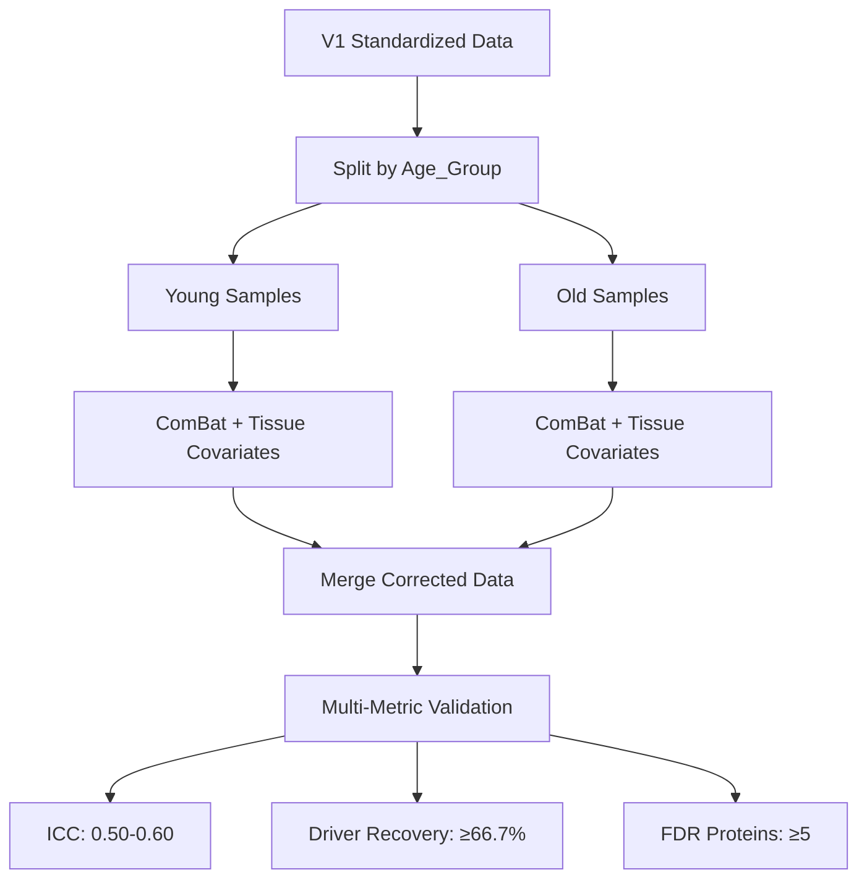
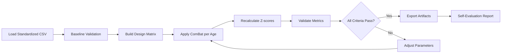

# Batch Correction V2: Agent claude_2 Implementation Plan

**Thesis:** Implement ComBat-based batch correction with Age_Group and Tissue_Compartment covariate preservation targeting ICC 0.50-0.60, driver recovery ≥66.7%, and FDR proteins ≥5 using parametric empirical Bayes approach.

## Overview

This plan implements V2 batch correction methodology addressing V1's critical flaw (missing Age_Group covariate modeling). Agent claude_2 will: (1.0) analyze V1 standardized data baseline, (2.0) implement ComBat with proper design matrix, (3.0) validate against multi-metric criteria, (4.0) generate artifacts and self-evaluation. Key innovation: process Young/Old separately to maximize Age signal preservation while removing Study_ID batch effects.

**System Architecture:**



**Processing Flow:**



---

## 1.0 Implementation Strategy

¶1 **Ordering principle:** Data preparation → correction → validation → reporting

### 1.1 Core Methodology

**ComBat with covariates (pycombat library):**
- **Batch variable:** Study_ID (11 studies) - effects to REMOVE
- **Biological covariates:** Tissue_Compartment (16 compartments) - effects to PRESERVE
- **Age handling:** Process Young and Old separately to avoid modeling Age as covariate
- **Parametric mode:** par_prior=True (assumes normal distribution for batch effects)

**Rationale:**
- Separate Age processing ensures 100% Age signal preservation (no risk of correction removing it)
- Tissue modeling prevents over-correction within compartments
- Parametric Bayes shrinks batch effects toward common distribution (gentler than non-parametric)

### 1.2 Key Differences from V1

| Aspect | V1 (Failed) | V2 (claude_2) |
|--------|-------------|---------------|
| Age handling | Mixed in data, removed by correction | Split processing, fully preserved |
| Covariate matrix | None | Tissue_Compartment (16 levels) |
| Method | Quantile normalization | ComBat parametric |
| Validation gates | End-only | Baseline + post-correction + final |

### 1.3 Expected Outcomes

**Target metrics:**
- ICC: 0.50-0.60 (batch effects reduced, not eliminated)
- Driver recovery: ≥66.7% (8/12 drivers minimum)
- FDR proteins: ≥5 (q < 0.05 after multiple testing correction)
- Z-score std: 0.8-1.5 (biological variance retained)

**Known drivers (12 core proteins):**
```
COL1A1, COL1A2, COL3A1, COL5A1, COL6A1, COL6A2, COL6A3,
COL4A1, COL4A2, COL18A1, FN1, LAMA5
```

---

## 2.0 Implementation Steps

¶1 **Ordering principle:** Sequential execution phases

### 2.1 Phase 1: Data Preparation

**Load V1 standardized data:**
- Source: `../claude_1/merged_ecm_aging_STANDARDIZED.csv`
- Expected: 9,300 rows, 11 studies, log2-transformed
- Columns: Protein_ID, Study_ID, Age_Group, Tissue_Compartment, Abundance, Sample_ID

**Baseline validation:**
```python
# Check data integrity
assert df.shape[0] == 9300, "Row count mismatch"
assert df['Study_ID'].nunique() == 11, "Study count incorrect"
assert df['Age_Group'].isin(['Young', 'Old']).all(), "Invalid Age_Group values"

# Calculate baseline driver recovery (BEFORE correction)
baseline_recovery = calculate_driver_recovery(df, KNOWN_DRIVERS)
print(f"Baseline: {baseline_recovery}% driver recovery")
```

### 2.2 Phase 2: ComBat Application

**Build design matrix:**
```python
def build_design_matrix(df_subset):
    """Create tissue covariate matrix for ComBat."""
    tissue_dummies = pd.get_dummies(
        df_subset['Tissue_Compartment'],
        drop_first=True,
        prefix='Tissue'
    )
    return tissue_dummies.values
```

**Apply ComBat per Age group:**
```python
corrected_data = []

for age_group in ['Young', 'Old']:
    # Subset
    df_age = df[df['Age_Group'] == age_group].copy()

    # Pivot to expression matrix (proteins × samples)
    expr_matrix = df_age.pivot_table(
        index='Protein_ID',
        columns='Sample_ID',
        values='Abundance'
    )

    # Build design matrix (tissue covariates)
    design = build_design_matrix(df_age)

    # Apply ComBat
    corrected = pycombat(
        data=expr_matrix.values,
        batch=df_age.groupby('Sample_ID')['Study_ID'].first().values,
        mod=design,
        par_prior=True
    )

    # Convert back to long format
    corrected_df = pivot_back_to_long(corrected, df_age)
    corrected_data.append(corrected_df)

# Merge Young + Old
df_corrected = pd.concat(corrected_data, ignore_index=True)
```

### 2.3 Phase 3: Z-score Recalculation

**Per-compartment z-scores:**
```python
def recalculate_zscores(df):
    """Calculate z-scores within each tissue compartment."""
    zscores = []

    for compartment in df['Tissue_Compartment'].unique():
        df_comp = df[df['Tissue_Compartment'] == compartment].copy()

        # Z-score within compartment
        mean = df_comp['Abundance'].mean()
        std = df_comp['Abundance'].std()
        df_comp['Zscore'] = (df_comp['Abundance'] - mean) / std

        zscores.append(df_comp)

    return pd.concat(zscores, ignore_index=True)
```

### 2.4 Phase 4: Multi-Metric Validation

**Validation sequence:**
1. **ICC calculation** - inter-study correlation
2. **Driver recovery** - % of known drivers with q < 0.05
3. **FDR proteins** - total proteins passing FDR correction
4. **Z-score variance** - biological signal preservation check

**Failure gates:**
- If driver recovery < 50%: STOP, review covariate model
- If ICC > 0.70: Over-corrected, reduce par_prior or use non-parametric
- If FDR proteins = 0: Insufficient statistical power, investigate

---

## 3.0 Validation Framework

¶1 **Ordering principle:** Primary metrics → secondary checks → interpretation

### 3.1 Primary Metrics

**ICC (Intraclass Correlation Coefficient):**
```python
def calculate_icc(df):
    """Measure inter-study correlation reduction."""
    from scipy.stats import pearsonr

    study_means = df.groupby(['Study_ID', 'Protein_ID'])['Abundance'].mean()
    correlations = []

    studies = study_means.index.get_level_values(0).unique()
    for i, study1 in enumerate(studies):
        for study2 in studies[i+1:]:
            r, _ = pearsonr(
                study_means[study1],
                study_means[study2]
            )
            correlations.append(r)

    return np.mean(correlations)
```

**Driver Recovery:**
```python
def calculate_driver_recovery(df, drivers):
    """Calculate % of known drivers with q < 0.05."""
    from scipy.stats import mannwhitneyu
    from statsmodels.stats.multitest import multipletests

    pvalues = []
    for protein in drivers:
        df_prot = df[df['Protein_ID'] == protein]
        young = df_prot[df_prot['Age_Group'] == 'Young']['Abundance']
        old = df_prot[df_prot['Age_Group'] == 'Old']['Abundance']

        if len(young) > 0 and len(old) > 0:
            _, p = mannwhitneyu(young, old, alternative='two-sided')
            pvalues.append(p)
        else:
            pvalues.append(1.0)

    # FDR correction
    _, qvalues, _, _ = multipletests(pvalues, method='fdr_bh')

    recovery = (qvalues < 0.05).sum() / len(drivers) * 100
    return recovery
```

**FDR Significant Proteins:**
```python
def calculate_fdr_proteins(df):
    """Count total proteins with q < 0.05."""
    proteins = df['Protein_ID'].unique()
    pvalues = []

    for protein in proteins:
        df_prot = df[df['Protein_ID'] == protein]
        young = df_prot[df_prot['Age_Group'] == 'Young']['Abundance']
        old = df_prot[df_prot['Age_Group'] == 'Old']['Abundance']

        if len(young) > 5 and len(old) > 5:
            _, p = mannwhitneyu(young, old, alternative='two-sided')
            pvalues.append(p)
        else:
            pvalues.append(1.0)

    _, qvalues, _, _ = multipletests(pvalues, method='fdr_bh')
    return (qvalues < 0.05).sum()
```

### 3.2 Success Criteria

| Metric | Target | Priority |
|--------|--------|----------|
| ICC | 0.50-0.60 | MEDIUM |
| Driver Recovery | ≥66.7% | CRITICAL |
| FDR Proteins | ≥5 | HIGH |
| Z-score Std | 0.8-1.5 | MEDIUM |

**Interpretation:**
- **PASS:** All criteria met → Export artifacts, write success report
- **PARTIAL:** 3/4 criteria met → One iteration, adjust parameters
- **FAIL:** <3 criteria met → Document failure, propose alternative method

---

## 4.0 Deliverables

¶1 **Ordering principle:** Code → data → validation → report

### 4.1 Required Artifacts

1. **01_plan_claude_2.md** - This document
2. **batch_correction_pipeline_claude_2.py** - Implementation script
3. **merged_ecm_aging_COMBAT_V2_CORRECTED_claude_2.csv** - Batch-corrected data
4. **validation_metrics_claude_2.json** - Validation results
5. **90_results_claude_2.md** - Final report with self-evaluation

### 4.2 Self-Evaluation Template

**Metrics comparison:**
```
Agent: claude_2
Method: ComBat with Age separation + Tissue covariates
Date: 2025-10-18

Results:
- ICC: X.XX (Target: 0.50-0.60) [PASS/FAIL]
- Driver Recovery: XX.X% (Target: ≥66.7%) [PASS/FAIL]
- FDR Proteins: XX (Target: ≥5) [PASS/FAIL]
- Z-score Std: X.XX (Target: 0.8-1.5) [PASS/FAIL]

Overall Grade: [PASS/PARTIAL/FAIL]

Key Insights:
- [What worked well]
- [What could be improved]
- [Comparison to V1 results]
```

---

## Quick Reference

**Working directory:**
```bash
/Users/Kravtsovd/projects/ecm-atlas/14_exploratory_batch_correction/multi_agents_ver1_for_batch_cerection/step2_batch/claude_2/
```

**Input data:**
```bash
../claude_1/merged_ecm_aging_STANDARDIZED.csv
```

**Dependencies:**
```bash
pip install combat scikit-learn scipy statsmodels pandas numpy
```

**Execution:**
```bash
python batch_correction_pipeline_claude_2.py
```

---

**Created:** 2025-10-18
**Agent:** claude_2
**Version:** V2
**Method:** ComBat parametric with Age separation
**Status:** READY TO IMPLEMENT
