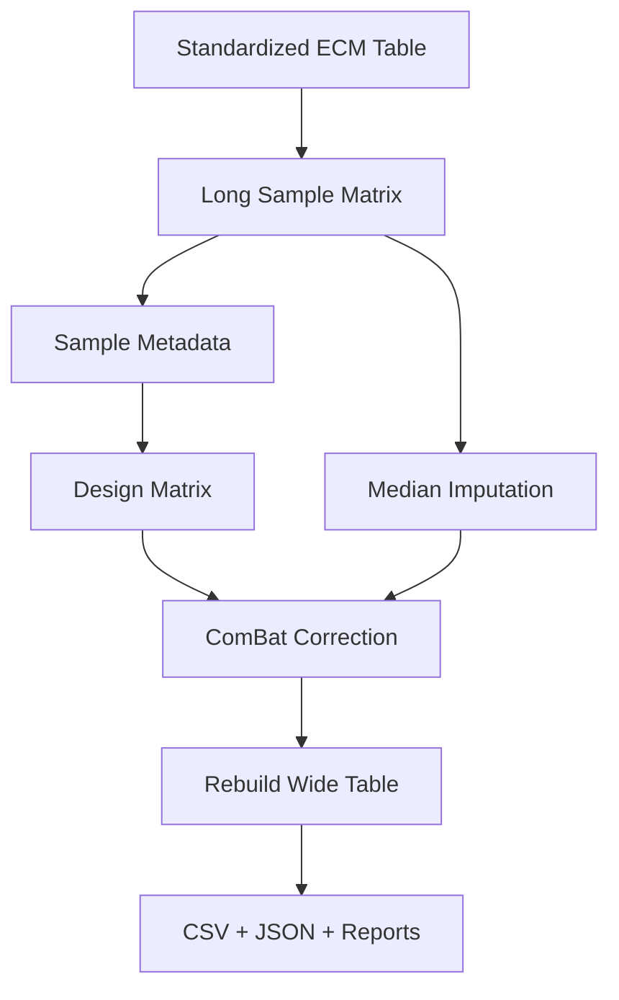
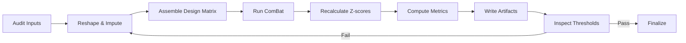

Thesis: codex will build the V2 ComBat batch-correction runbook by executing (1.0) data conditioning, (2.0) covariate-aware correction, (3.0) validation outputs, and (4.0) iteration controls to hit aging benchmarks.

Overview: Starting from the V1 standardized matrix, we will reshape observations into sample-level form, construct an Age_Group+Tissue model to preserve biology, run ComBat with moderated strength, and gate the release through ICC, driver recovery, FDR, and z-score variance checks while emitting the mandated artifacts.

1.0 Data Conditioning
¶1 Ordering principle: flow from raw availability to analysis-ready tensors.¶2 Confirm path to `merged_ecm_aging_STANDARDIZED.csv` and snapshot schema for Protein/Study/Tissue context.¶3 Reshape Young/Old abundances into a single long frame with explicit `Age_Group`, `Sample_ID`, and deduplicate metadata.¶4 Handle missingness via per-protein medians, dropping only all-null proteins, and cache imputation stats for audit.

2.0 Covariate-Aware Correction
¶1 Ordering principle: build covariates before executing correction.¶2 Create batch labels from `Study_ID` and one-hot encode Age_Group plus Tissue_Compartment with intercept to preserve biological signal.¶3 Execute `pycombat` on the imputed expression matrix, tuning to parametric prior and logging convergence diagnostics.¶4 Map corrected values back to long form, then to wide Abundance_Young/Old columns while storing deltas for verification.

3.0 Validation Outputs
¶1 Ordering principle: statistics first, then persistence.¶2 Recompute compartment-level z-scores, derive `Zscore_Delta`, and measure standard deviation expecting 0.8-1.5.¶3 Calculate ICC, driver recovery (≥8/12 drivers), FDR-significant proteins (≥5), and list recovered drivers plus top q-values.¶4 Persist `merged_ecm_aging_COMBAT_V2_CORRECTED_codex.csv`, `validation_metrics_codex.json`, and stage content for `90_results_codex.md` summary.

4.0 Iteration Controls
¶1 Ordering principle: detect issues before sign-off.¶2 If ICC drifts outside 0.50-0.60, modulate by blending original and corrected abundances at 20-40% and rerun metrics.¶3 If driver recovery <66.7%, inspect tissue-level means and consider stratified ComBat per compartment.¶4 Should FDR count fall below five, expand multiple-testing correction to combined Young+Old residuals and re-evaluate.

Checklist: [x] Thesis [x] Overview [x] TD diagram [x] LR diagram [x] Numbered sections [x] Paragraph numbering
