# Data Scale Issue: Why Distribution Matters for Batch Correction

**Date:** 2025-10-18
**Issue:** User questioned whether using z-scores vs raw abundances affects batch correction validity
**Status:** ✅ **CRITICAL INSIGHT** - Inconsistent log-transformation is the root cause

---

## Executive Summary

**User's Question:** "ComBat works with z-scores directly, right? In this case, it's not important how raw intensities were reported or processed -- once we have z-scores everything is normalized?"

**Answer:** ❌ **NO** - Batch correction (ComBat, percentile) requires **comparable scales across studies**, not within-study normalization (z-scores). Our scripts correctly use raw abundances, but **inconsistent log-transformation across studies** likely explains poor driver recovery (20%).

---

## 1.0 The Z-Score Misconception

### 1.1 What Z-Scores Actually Do

**Within-study z-scores** (current implementation):
```
Study A - Kidney Glomerular:
  COL14A1_old = 28.5 (log2 LFQ) → Zscore_old = -0.5 (relative to Study A kidney mean)
  LAMB1_old = 24.3 (log2 LFQ) → Zscore_old = -1.3 (relative to Study A kidney mean)

Study B - Kidney Glomerular:
  COL14A1_old = 32.0 (log2 LFQ) → Zscore_old = +0.3 (relative to Study B kidney mean)
  LAMB1_old = 29.5 (log2 LFQ) → Zscore_old = +0.1 (relative to Study B kidney mean)
```

**Problem:** Study A and Study B z-scores are **NOT comparable** because:
- Different protein coverage (proteome depth)
- Different background ECM composition
- Different absolute abundance scales

**Z-scores remove all between-study information:**
- Mean = 0 in **every** study
- Std = 1 in **every** study
- Batch effects are **normalized away**, not detected

### 1.2 Why ComBat Can't Use Within-Study Z-Scores

**ComBat's algorithm:**
```
1. Estimate batch-specific location shift: μ_batch_i
2. Estimate batch-specific scale factor: σ_batch_i
3. Adjust each batch: X_corrected = (X_raw - μ_batch_i) / σ_batch_i
```

**If input is within-study z-scores:**
- μ_batch_i = 0 for ALL batches (no location shift to estimate)
- σ_batch_i = 1 for ALL batches (no scale difference to estimate)
- **ComBat has nothing to correct!**

**Analogy:**
- Trying to measure temperature differences between rooms after converting all temperatures to "percentage of that room's temperature range"
- Room A: 0% (coldest in Room A) vs Room B: 0% (coldest in Room B) → cannot compare

---

## 2.0 What Our Scripts Actually Do

### 2.1 Percentile Normalization (01_apply_percentile.py)

**Line 80:**
```python
df['Percentile'] = df.groupby('Study_ID')['Abundance'].transform(calculate_percentile)
```

**Input:** `'Abundance'` column = **raw log2-transformed LFQ intensities** (range ~20-35)
**NOT:** Z-scores

**✅ CORRECT:** Uses raw abundances, preserves between-study differences

### 2.2 ComBat Correction (01_apply_combat.R)

**Lines 78-79:**
```r
select(Protein_ID, Sample_ID, Abundance) %>%
pivot_wider(names_from = Sample_ID, values_from = Abundance)
```

**Input:** `Abundance` column = **raw log2-transformed LFQ intensities**
**NOT:** Z-scores

**Line 220 (AFTER ComBat):**
```r
Z_score = scale(Abundance)[, 1]  # Recalculate z-scores AFTER correction
```

**✅ CORRECT:** ComBat uses raw abundances, then recalculates z-scores on batch-corrected data

### 2.3 Workflow Diagram

```mermaid
graph LR
    A[Raw log2 Abundances<br/>Study A: 20-35 range<br/>Study B: 22-37 range] --> B[ComBat Correction]
    B --> C[Batch-Corrected Abundances<br/>Study A: 21-36<br/>Study B: 21-36]
    C --> D[Recalculate Z-scores<br/>Now comparable!]

    A2[❌ WRONG APPROACH] --> B2[Within-Study Z-scores<br/>Study A: mean=0, std=1<br/>Study B: mean=0, std=1]
    B2 --> C2[ComBat finds no batch effects<br/>Nothing to correct]

    style B fill:#51cf66
    style D fill:#51cf66
    style B2 fill:#ff6b6b
    style C2 fill:#ff6b6b
```



---

## 3.0 The REAL Problem: Inconsistent Log-Transformation

### 3.1 Z-Score Calculation Documentation

From `11_subagent_for_LFQ_ingestion/02_ZSCORE_CALCULATION_UNIVERSAL_FUNCTION.md:86-97`:

```python
# Step 1: Check skewness (on non-NaN values)
skew_young = skew(Abundance_Young.dropna())
skew_old = skew(Abundance_Old.dropna())

# Step 2: CONDITIONAL transformation
if (skew_young > 1) OR (skew_old > 1):
    young_values = log2(Abundance_Young + 1)  # LOG-TRANSFORM
    old_values = log2(Abundance_Old + 1)
else:
    young_values = Abundance_Young  # NO TRANSFORM (linear scale)
    old_values = Abundance_Old

# Step 3: Calculate z-scores on transformed values
Zscore_Young = (young_values - mean_young) / std_young
```

**Key Issue:** Different studies/compartments get **different transformations**

### 3.2 Observed Data Distributions

From `investigate_data_distribution.py` (partial run):

**Wide format data:**
```
Raw Abundances (all studies combined):
  Range: [0.04, 201,533,105.60]  ← HUGE range (linear scale)
  Mean: 162,494.98
  Skewness: 49.56 (extremely right-skewed)
  Shapiro-Wilk p < 0.0001 (NOT NORMAL)
```

**BUT specific protein examples:**
```
TNXB:   Abundance_Old = 28.38  ← Log2-transformed (typical LFQ range)
COL14A1: Abundance_Old = 28.16  ← Log2-transformed
LAMB1:   Abundance_Old = 24.31  ← Log2-transformed
```

**Interpretation:**
- Some studies stored abundances in **linear scale** (0.04 to 200 million)
- Other studies stored abundances in **log2 scale** (20-35)
- Conditional log-transformation (skewness > 1) was applied **per study-compartment**
- **Result:** Mixed scales in the merged dataset

### 3.3 Why This Breaks Cross-Study Comparisons

**Example scenario:**

| Study | Compartment | Skewness | Transform Applied | COL14A1 Abundance | Scale |
|-------|-------------|----------|-------------------|-------------------|-------|
| Giant_2017 | Kidney_Glom | 0.8 | **NONE** (linear) | 150,000 | Linear |
| Randles_2021 | Kidney_Glom | 2.5 | **log2(x+1)** | 28.5 (=log2(150k)) | Log2 |

**When we apply percentile ranking:**
- Giant_2017: Ranks proteins by linear-scale differences (0-200M)
- Randles_2021: Ranks proteins by log-scale differences (20-35)
- **Meta-analysis averages ranks from incompatible scales** → biological signal lost

**When we apply ComBat:**
- ComBat tries to estimate batch effect: 150,000 - 28.5 = 149,971.5 ❌
- This is nonsense - comparing apples to oranges
- ComBat may fail to converge or produce meaningless corrections

---

## 4.0 Evidence from Percentile Results

### 4.1 Driver Recovery Failure

**Expected (from Agent 2 Spearman):** 66.7% recovery (4/6 drivers)
**Observed (percentile normalization):** 20% recovery (1/5 drivers)

**Explanation:**
- Studies with log-transformed data: COL14A1 declines from 30.5 → 28.2 (Δ=-2.3 log2 units)
- Studies with linear data: COL14A1 declines from 200,000 → 150,000 (Δ=-50,000 linear units)
- **Percentile ranks treat these equally** (both = ~60th percentile → ~40th percentile)
- **But the linear-scale study dominates variance** → drowns out log-scale signal

### 4.2 Statistical Power Loss

**Percentile meta-analysis:**
- Proteins tested: 326 (filtered to ≥3 studies)
- FDR-significant: 1 (VTN, FDR=0.538 - still not <0.05)
- **Effective FDR power: 0**

**Why:**
- Large variance in Δpercentile across studies (e.g., VTN: SD=23.1)
- Variance driven by **scale incompatibility**, not biological variability
- Statistical tests interpret this as "inconsistent effect" → high p-values

---

## 5.0 Solutions

### 5.1 Option 1: Consistent Log2-Transformation (RECOMMENDED)

**Before percentile or ComBat:**
```python
# Check if each abundance value is likely linear (>1000) or log (20-40)
def standardize_to_log2(abundance):
    if pd.isna(abundance):
        return np.nan
    elif abundance > 100:  # Likely linear scale
        return np.log2(abundance + 1)
    else:  # Likely already log2
        return abundance

df['Abundance_Standardized'] = df['Abundance'].apply(standardize_to_log2)
```

**Then apply percentile/ComBat on `Abundance_Standardized`**

**Advantages:**
- All studies on same scale (log2)
- ComBat can correctly estimate batch effects
- Percentile ranks are comparable across studies

### 5.2 Option 2: Global Z-Scores (Alternative)

**Calculate z-scores ACROSS all studies:**
```python
# Global mean/std (not within-study)
global_mean = df['Abundance_Standardized'].mean()
global_std = df['Abundance_Standardized'].std()

df['Zscore_Global'] = (df['Abundance_Standardized'] - global_mean) / global_std
```

**Then apply ComBat on global z-scores**

**Advantages:**
- Preserves between-study differences
- Standardizes scale to mean=0, std=1 globally
- ComBat can detect batch effects as deviations from global distribution

### 5.3 Option 3: Within-Study Analysis Only (Conservative)

**Accept that cross-study comparisons are unreliable:**
- Report only within-study findings (no batch correction needed)
- Use consensus proteins (n=8, validated by ≥2 methods) as high-confidence subset
- Add disclaimer: "Cross-study integration limited by scale heterogeneity"

**Advantages:**
- No risk of over-correction
- Findings are robust (validated within each study independently)
- Transparent about limitations

---

## 6.0 Validation Plan

### 6.1 Diagnostic Steps

**Step 1: Categorize each study by scale**
```python
# For each Study_ID, check median abundance range
for study in df['Study_ID'].unique():
    study_data = df[df['Study_ID'] == study]['Abundance'].dropna()
    median_abundance = study_data.median()

    if median_abundance > 1000:
        scale = "LINEAR"
    elif 20 <= median_abundance <= 40:
        scale = "LOG2"
    else:
        scale = "UNKNOWN"

    print(f"{study}: median={median_abundance:.1f} → {scale}")
```

**Step 2: Check if Abundance_Old_transformed exists**
From wide format CSV columns: `Abundance_Old_transformed`, `Abundance_Young_transformed`

These columns likely contain **post-transformation** abundances (all in log2 scale).

**Step 3: Re-run percentile using `Abundance_*_transformed`**
```python
# Use transformed column if available, otherwise raw
df['Abundance_Std'] = df.get('Abundance_transformed', df['Abundance'])
df['Percentile'] = df.groupby('Study_ID')['Abundance_Std'].transform(calculate_percentile)
```

### 6.2 Expected Outcomes

**If scale inconsistency is the root cause:**
- Driver recovery improves from 20% → 50-70%
- FDR-significant proteins increase from 1 → 5-10
- ICC decreases (batch effects become detectable)
- ComBat can correct and improve ICC → >0.5

**If the problem persists:**
- Likely insufficient statistical power (N=3-5 studies per protein)
- Accept within-study findings only
- Require external validation for cross-study claims

---

## 7.0 Conclusions

### 7.1 Key Findings

1. ✅ **Scripts are correctly designed:** ComBat and percentile both use raw abundances, not within-study z-scores
2. ⚠️ **Data contains mixed scales:** Some studies linear (0-200M), others log2 (20-35)
3. ❌ **Conditional log-transformation created incompatibility:** Z-scores calculated on mixed-scale data
4. 🔴 **This explains poor driver recovery:** Percentile ranks average across incompatible scales → signal loss

### 7.2 Recommendations

**Immediate:**
1. Check if `Abundance_Old_transformed` / `Abundance_Young_transformed` columns contain consistently log2-scaled data
2. If yes: **Re-run percentile normalization using transformed columns**
3. Document scale standardization in methods

**For ComBat (when R installed):**
1. Use `Abundance_*_transformed` columns (consistent log2 scale)
2. Verify all studies in same scale before running ComBat
3. Compare driver recovery before/after scale standardization

**For final analysis:**
- If scale standardization fixes driver recovery: Proceed with batch correction
- If issue persists: Revert to within-study findings only (Option 3)

---

**Report prepared by:** Autonomous Analysis Agent
**Date:** 2025-10-18
**Status:** Root cause identified; validation pending
**Next:** Verify `Abundance_transformed` column consistency and re-run percentile
