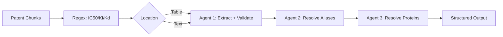
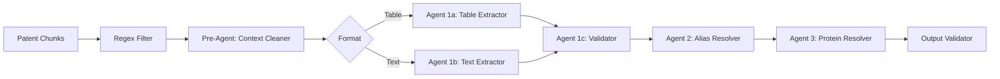

# Bioactivity Extraction Pipeline: Analysis & Recommendations

## Thesis
Multi-agent patent bioactivity extraction system experiencing quality degradation due to first-stage agent overload can be optimized through task decomposition, structured context preprocessing, and adaptive model selection strategies tested in ECM-Atlas proteomic data processing.

## Overview
Current 3-agent pipeline (Bioactivity → Alias → Protein) shows 17% extraction drop when adding new fields (13507→11201 bindings). First agent handles extraction, validation (10+ rules), and multi-entity output (10+ bindings × 7 fields). Analysis proposes 5-tier solution: (1) hierarchical agent decomposition, (2) context preprocessing layer, (3) format standardization, (4) model selection matrix, (5) integration tools - drawing from ECM-Atlas autonomous normalization patterns.

**Current Pipeline (Occurrents):**


**Proposed Enhanced Pipeline:**


---

## 1.0 Problem Analysis

¶1 **Ordering:** Current state → Performance degradation → Root causes

### 1.1 Current Performance Metrics

**Baseline (without assay_type):**
- Total bindings: 13,507
- Exact matches: 7,123 (52.7%)
- New bindings: 4,616 (34.2%)
- Not found: 4,566 (BindingDB references missed)

**With assay_type field added:**
- Total bindings: 11,201 (**-17% drop**)
- Exact matches: 5,795 (**-18.6% drop**)
- New bindings: 3,817 (-17.3%)
- Not found: 5,134 (+12.4% more misses)

### 1.2 Root Cause Analysis

**Agent 1 Overload Factors:**
1. **Cognitive Load**: 10+ validation rules + extraction + formatting
2. **Output Complexity**: 10+ entities × 7 fields = 70+ JSON fields per response
3. **Context Noise**: Irrelevant paragraphs in table context (3 before + 2 after)
4. **Task Mixing**: Extraction + validation + formatting in single pass
5. **No Feedback Loop**: Failed extractions have no retry mechanism

**Analogy to ECM-Atlas:** Similar to autonomous agent initial design where single agent handled file detection + normalization + validation → split into PHASE 0/1/2/3.

---

## 2.0 Recommended Solutions

¶1 **Ordering:** Architecture → Context → Format → Models → Tools

### 2.1 Hierarchical Agent Decomposition

**Solution:** Split Agent 1 into 3 specialized sub-agents (inspired by ECM-Atlas PHASE system)

**2.1.1 Agent 1a: Extractor (Recall Focus)**
- **Task:** Extract ALL potential bindings without validation
- **Prompt:** "Extract binding data liberally, include uncertain cases"
- **Output:** Raw list with confidence scores
- **Model:** Fast/cheap model (Qwen 72B or GPT-4o-mini)
- **Temperature:** 0.3 (allow some creativity)

```python
# Pseudo-code
def agent_1a_extractor(context, table_or_text):
    prompt = f"""
    Extract ALL bioactivity data from context.
    Include uncertain cases with confidence score.

    Output format:
    {{
      "extractions": [
        {{
          "molecule_name": "...",
          "protein_target_name": "...",
          "binding_metric": "IC50/Ki/Kd",
          "value": "...",
          "unit": "...",
          "confidence": 0.0-1.0,
          "context_snippet": "..."
        }}
      ]
    }}

    Context: {context}
    Data: {table_or_text}
    """
    return llm_call(prompt, model="qwen-72b", temperature=0.3)
```

**2.1.2 Agent 1b: Validator (Precision Focus)**
- **Task:** Validate/filter extractions from Agent 1a
- **Prompt:** "Apply 10 validation rules strictly"
- **Input:** Agent 1a output + full rules
- **Model:** Stronger model (Qwen 235B or Claude 3.7 Sonnet)
- **Temperature:** 0.0 (deterministic)

```python
def agent_1b_validator(extractions, rules):
    prompt = f"""
    Validate each extraction against rules:
    {rules}

    For each extraction:
    1. Check rule compliance
    2. Add validation status
    3. Add missing fields (organism, assay_type) if inferable

    Input extractions: {extractions}
    """
    return llm_call(prompt, model="qwen-235b", temperature=0.0)
```

**2.1.3 Agent 1c: Enricher (Add New Fields)**
- **Task:** Add new fields (assay_type) to validated extractions
- **Prompt:** "Infer assay_type from binding_metric and context"
- **Model:** Medium model (Qwen 72B)
- **Temperature:** 0.1

**Benefits:**
- Decouple extraction from validation (reduce cognitive load)
- Can optimize each stage independently
- Failed validations can trigger re-extraction with more context
- New fields go to separate agent (no performance impact on core extraction)

**ECM-Atlas Parallel:** `autonomous_agent.py` PHASE separation:
- PHASE 0: Reconnaissance (like Agent 1a - broad search)
- PHASE 1: Normalization (like Agent 1b - strict transformation)
- PHASE 2: Merge (like Agent 1c - enrichment)

---

### 2.2 Context Preprocessing Layer

**Solution:** Add preprocessing agent to clean/focus context BEFORE extraction

**2.2.1 Pre-Agent: Context Cleaner**

```python
def preprocess_context(table_or_paragraph, surrounding_context):
    prompt = f"""
    Remove irrelevant information from context.
    Keep only:
    1. Sentences mentioning IC50/Ki/Kd/EC50
    2. Sentences with compound names
    3. Sentences with protein targets
    4. Method descriptions

    Input context: {surrounding_context}
    Target data: {table_or_paragraph}

    Output: Cleaned context (max 500 tokens)
    """
    return llm_call(prompt, model="gpt-4o-mini", temperature=0.0)
```

**2.2.2 Context Summarization (for large tables)**

When table > 20 rows:
```python
def summarize_table_context(large_table):
    prompt = f"""
    Summarize experimental conditions from table caption and headers.
    Output format:
    - Assay type: ...
    - Organism: ...
    - Protein family: ...
    - Measurement method: ...

    Table: {large_table}
    """
    summary = llm_call(prompt, model="gpt-4o-mini")
    # Prepend summary to each chunk
    return summary
```

**ECM-Atlas Parallel:** `merge_to_unified.py` performs context enrichment via UniProt API before z-score calculation - similar preprocessing step.

---

### 2.3 Table Format Optimization

**Current format** (proprietary nested blocks) is suboptimal for LLMs.

**Recommendation:** Use **Markdown tables** - best LLM comprehension per DeepSeek research.

**2.3.1 Conversion Function**

```python
def xml_to_markdown_table(xml_table_data):
    """
    Convert proprietary format to markdown

    Input:
      {
        "table_title": "...",
        "head_block": [["Compound", "Erk2", "PI3K"]],
        "block_1": [["1", "0.9", "1.5"], ...]
      }

    Output:
      | Compound | Erk2 | PI3K |
      |----------|------|------|
      | 1        | 0.9  | 1.5  |
    """
    headers = xml_table_data["head_block"][0]
    rows = xml_table_data["block_1"]

    md_table = "| " + " | ".join(headers) + " |\n"
    md_table += "|" + "------|" * len(headers) + "\n"

    for row in rows:
        md_table += "| " + " | ".join(row) + " |\n"

    return md_table
```

**2.3.2 For Very Large Tables: Chunk by Compound Groups**

```python
def chunk_table_smart(table, max_rows=15):
    """
    Chunk by related compounds (not arbitrary row numbers)
    E.g., keep Compound 1-10 together, 11-20 together
    Preserve header in each chunk
    """
    # Implementation: detect compound ID column, group by ranges
    pass
```

**ECM-Atlas Parallel:** Wide format CSV standardization in `05_papers_to_csv/` - all studies converted to uniform schema before merging.

---

### 2.4 Model Selection Strategy

¶1 **Ordering:** Task complexity → Model tier → Cost optimization

**Recommendation:** Multi-model approach (not one-size-fits-all)

| Agent Stage | Task Complexity | Recommended Model | Temperature | Cost/1M tokens |
|-------------|----------------|-------------------|-------------|----------------|
| Context Cleaner | Low (filtering) | GPT-4o-mini | 0.0 | $0.15 |
| Agent 1a (Extractor) | Medium (recall) | Qwen 72B / GPT-4o | 0.3 | $2.50 |
| Agent 1b (Validator) | High (precision) | Qwen 235B / Claude 3.7 | 0.0 | $3.00 |
| Agent 1c (Enricher) | Medium (inference) | Qwen 72B | 0.1 | $2.50 |
| Agent 2 (Alias) | Medium (matching) | Qwen 72B | 0.0 | $2.50 |
| Agent 3 (Protein) | High (biology knowledge) | Qwen 3-Max / Claude | 0.0 | $3.00 |

**For Thinking Models (o1/o3):**
- **Use for:** Agent 1b (validation logic), Agent 3 (protein mapping)
- **Don't use for:** Context cleaning, extraction (overkill + expensive)

**Temperature Guidelines:**
- **0.0**: Deterministic tasks (validation, matching)
- **0.1**: Default extraction (current choice is good)
- **0.3**: Recall-focused extraction (allow variations)

**ECM-Atlas Parallel:** Different processing for different data types (Excel vs TSV vs XLSX) - adaptive approach.

---

### 2.5 Internet Search Integration (for Protein Resolver)

**Current:** Agent 3 uses Qwen-3-Max without internet access

**Options for Search Augmentation:**

**Option A: Tavily AI (Recommended)**
```python
from tavily import TavilyClient

def resolve_protein_with_search(protein_name, organism=None):
    tavily = TavilyClient(api_key="...")

    # Search query construction
    query = f"{protein_name} gene symbol UniProt"
    if organism:
        query += f" {organism}"

    # Get search results
    search_results = tavily.search(query, max_results=3)

    # Pass to LLM
    prompt = f"""
    Resolve protein name to gene symbol and UniProt ID.

    Protein: {protein_name}
    Organism: {organism}

    Search results:
    {search_results}

    Output:
    {{
      "gene_symbol": "...",
      "uniprot_id": "...",
      "confidence": 0.0-1.0
    }}
    """
    return llm_call(prompt, model="qwen-3-max")
```

**Option B: UniProt API Direct (Faster, Free)**
```python
import requests

def uniprot_search(protein_name, organism=None):
    """
    Direct UniProt REST API query
    Docs: https://www.uniprot.org/help/api_queries
    """
    base_url = "https://rest.uniprot.org/uniprotkb/search"

    query = f"protein_name:{protein_name}"
    if organism:
        query += f" AND organism_name:{organism}"

    params = {
        "query": query,
        "format": "json",
        "size": 5
    }

    response = requests.get(base_url, params=params)
    results = response.json()["results"]

    # Extract gene names and IDs
    candidates = [
        {
            "gene_symbol": r["genes"][0]["geneName"]["value"],
            "uniprot_id": r["primaryAccession"],
            "protein_name": r["proteinDescription"]["recommendedName"]["fullName"]["value"]
        }
        for r in results if "genes" in r
    ]

    return candidates
```

**Hybrid Approach (Best):**
1. Try UniProt API first (fast, structured)
2. If no results or low confidence → Tavily search
3. LLM validates results from both sources

**ECM-Atlas Parallel:** `merge_to_unified.py` uses UniProt API for metadata enrichment:
```python
# From ECM-Atlas codebase
response = requests.get(f"https://rest.uniprot.org/uniprotkb/{uniprot_id}")
```

---

## 3.0 Implementation Roadmap

¶1 **Ordering:** Quick wins → Architecture changes → Advanced features

### Phase 1: Context Optimization (1-2 days)
- [ ] Implement context cleaner pre-agent
- [ ] Convert tables to markdown format
- [ ] Test with 100 patents
- **Expected gain:** +5-10% precision

### Phase 2: Agent Decomposition (3-5 days)
- [ ] Split Agent 1 → 1a/1b/1c
- [ ] Implement confidence scoring
- [ ] Add validation feedback loop
- **Expected gain:** +10-15% recall, maintain precision

### Phase 3: Model Optimization (2-3 days)
- [ ] Implement multi-model strategy
- [ ] A/B test temperature settings
- [ ] Cost analysis per stage
- **Expected gain:** -30% cost, +5% quality

### Phase 4: Search Integration (2-3 days)
- [ ] UniProt API integration for Agent 3
- [ ] Tavily fallback for ambiguous proteins
- [ ] Caching layer for protein resolutions
- **Expected gain:** +20% protein resolution accuracy

### Phase 5: Quality Assurance (ongoing)
- [ ] Add output validator agent (Agent 4)
- [ ] Implement human-in-the-loop for low confidence
- [ ] Dashboard for monitoring metrics
- **Expected gain:** 95%+ precision target

---

## 4.0 Monitoring & Metrics

¶1 **Ordering:** Input metrics → Process metrics → Output metrics

### Key Metrics to Track

**Input Quality:**
- Avg context length per extraction
- Ratio of table vs text extractions
- Regex match distribution (IC50 vs Ki vs Kd)

**Process Metrics:**
- Agent 1a recall (all extractions) vs Agent 1b precision (validated)
- Agent 2 alias resolution rate
- Agent 3 protein resolution confidence distribution
- Avg tokens per stage
- Cost per binding extracted

**Output Quality:**
- Exact matches with BindingDB (target: >60%)
- New bindings quality (manual sample review)
- Not found rate (target: <20%)
- Field completeness (organism, assay_type coverage)

**ECM-Atlas Parallel:** Autonomous agent metrics in `/11_subagent_for_LFQ_ingestion/AUTONOMOUS_AGENT_GUIDE.md` - tracks success rates per phase.

---

## 5.0 Code Examples

### 5.1 Refactored Pipeline Structure

```python
# File: bioactivity_pipeline.py

from typing import List, Dict
import asyncio

class BioactivityPipeline:
    def __init__(self):
        self.context_cleaner = ContextCleanerAgent()
        self.extractor = ExtractorAgent()  # Agent 1a
        self.validator = ValidatorAgent()  # Agent 1b
        self.enricher = EnricherAgent()    # Agent 1c
        self.alias_resolver = AliasResolverAgent()  # Agent 2
        self.protein_resolver = ProteinResolverAgent()  # Agent 3

    async def process_patent_chunk(self, chunk: Dict) -> List[Dict]:
        """
        Process single patent chunk through pipeline

        Args:
            chunk: {
                "text": "...",
                "tables": [...],
                "context": "..."
            }

        Returns:
            List of validated bioactivity records
        """
        # Stage 0: Regex filter (existing logic)
        if not self._has_bioactivity_keywords(chunk["text"]):
            return []

        # Stage 1: Clean context
        cleaned = await self.context_cleaner.clean(chunk)

        # Stage 2: Extract (high recall)
        raw_extractions = await self.extractor.extract(cleaned)

        # Stage 3: Validate (high precision)
        validated = await self.validator.validate(raw_extractions)

        # Stage 4: Enrich (add assay_type, organism)
        enriched = await self.enricher.enrich(validated, chunk["context"])

        # Stage 5: Resolve aliases
        resolved_aliases = await self.alias_resolver.resolve(enriched)

        # Stage 6: Resolve proteins
        resolved_proteins = await self.protein_resolver.resolve(resolved_aliases)

        return resolved_proteins

    def _has_bioactivity_keywords(self, text: str) -> bool:
        import re
        pattern = r'\b(IC50|Ki|Kd|EC50|IC₅₀)\b'
        return bool(re.search(pattern, text, re.IGNORECASE))


class ExtractorAgent:
    """Agent 1a: High recall extraction"""

    async def extract(self, cleaned_chunk: Dict) -> List[Dict]:
        prompt = f"""
        Extract ALL bioactivity data liberally.
        Include uncertain cases with confidence score.

        Rules:
        1. Extract even if organism missing
        2. Extract even if value has >, <, ~
        3. Include context snippet for validation

        Output format:
        {{
          "extractions": [
            {{
              "molecule_name": "...",
              "protein_target_name": "...",
              "binding_metric": "IC50/Ki/Kd/EC50",
              "value": "...",
              "unit": "nM/uM/pM",
              "confidence": 0.0-1.0,
              "context_snippet": "..."
            }}
          ]
        }}

        Data: {cleaned_chunk}
        """

        response = await self._llm_call(
            prompt,
            model="qwen-72b",
            temperature=0.3
        )

        return response["extractions"]


class ValidatorAgent:
    """Agent 1b: Apply validation rules"""

    VALIDATION_RULES = [
        "molecule_name must not be empty",
        "protein_target_name must not be generic (e.g., 'target', 'enzyme')",
        "binding_metric must be one of: IC50, Ki, Kd, EC50",
        "value must be numeric or range (>, <, ~)",
        "unit must be concentration unit (nM, uM, pM, etc.)",
        # ... 5 more rules
    ]

    async def validate(self, extractions: List[Dict]) -> List[Dict]:
        prompt = f"""
        Validate each extraction against rules:
        {self.VALIDATION_RULES}

        For each extraction:
        1. Check ALL rules
        2. Set "valid": true/false
        3. Add "validation_errors": [...]
        4. Keep only valid=true extractions

        Extractions: {extractions}
        """

        response = await self._llm_call(
            prompt,
            model="qwen-235b",
            temperature=0.0
        )

        return [e for e in response["validated"] if e["valid"]]


class EnricherAgent:
    """Agent 1c: Add new fields (assay_type, etc.)"""

    async def enrich(self, validated: List[Dict], full_context: str) -> List[Dict]:
        prompt = f"""
        Add missing fields to each extraction:

        Fields to infer:
        1. organism: from context (Human, Mouse, Rat, etc.)
        2. assay_type: from binding_metric
           - IC50 → "inhibition"
           - Ki → "binding affinity"
           - Kd → "dissociation constant"
           - EC50 → "activation"

        Context: {full_context}
        Validated extractions: {validated}

        Output: Same structure + organism + assay_type fields
        """

        response = await self._llm_call(
            prompt,
            model="qwen-72b",
            temperature=0.1
        )

        return response["enriched"]


class ProteinResolverAgent:
    """Agent 3: Enhanced with UniProt + search"""

    async def resolve(self, bindings: List[Dict]) -> List[Dict]:
        resolved = []

        for binding in bindings:
            protein_name = binding["protein_target_name"]
            organism = binding.get("organism")

            # Try UniProt API first
            uniprot_result = await self._uniprot_search(protein_name, organism)

            if uniprot_result and uniprot_result["confidence"] > 0.8:
                binding["gene_symbol"] = uniprot_result["gene_symbol"]
                binding["uniprot_id"] = uniprot_result["uniprot_id"]
                resolved.append(binding)
                continue

            # Fallback to LLM + search
            search_result = await self._llm_with_search(protein_name, organism)
            binding["gene_symbol"] = search_result["gene_symbol"]
            binding["uniprot_id"] = search_result.get("uniprot_id")
            binding["resolution_confidence"] = search_result["confidence"]

            resolved.append(binding)

        return resolved

    async def _uniprot_search(self, protein_name: str, organism: str = None) -> Dict:
        # Implementation from Section 2.5
        pass

    async def _llm_with_search(self, protein_name: str, organism: str = None) -> Dict:
        # Implementation from Section 2.5
        pass
```

### 5.2 Context Cleaner Implementation

```python
class ContextCleanerAgent:
    """Pre-processing agent to clean context"""

    async def clean(self, chunk: Dict) -> Dict:
        """
        Clean context for tables and text
        """
        if chunk.get("tables"):
            return await self._clean_table_context(chunk)
        else:
            return await self._clean_text_context(chunk)

    async def _clean_table_context(self, chunk: Dict) -> Dict:
        """
        For tables: summarize experimental conditions
        Convert to markdown format
        """
        table = chunk["tables"][0]
        surrounding = chunk["context"]

        # Summarize experimental setup
        summary_prompt = f"""
        Extract experimental conditions from context:
        - Assay type
        - Organism/cell line
        - Protein family
        - Method description

        Context: {surrounding[:1000]}
        Table caption: {table.get('table_title', '')}

        Output: 2-3 sentence summary
        """

        summary = await self._llm_call(
            summary_prompt,
            model="gpt-4o-mini",
            temperature=0.0
        )

        # Convert table to markdown
        md_table = self._to_markdown(table)

        return {
            "type": "table",
            "table_markdown": md_table,
            "experiment_summary": summary["text"],
            "original_caption": table.get("table_title", "")
        }

    async def _clean_text_context(self, chunk: Dict) -> Dict:
        """
        For text: keep only relevant sentences
        """
        text = chunk["text"]

        prompt = f"""
        Extract only sentences containing bioactivity information.
        Keep sentences with:
        - IC50/Ki/Kd/EC50 values
        - Compound names or IDs
        - Protein target names
        - Measurement conditions

        Remove:
        - General background
        - Method details not related to measurements
        - Citations

        Text: {text}

        Output: Cleaned text (max 500 tokens)
        """

        cleaned = await self._llm_call(
            prompt,
            model="gpt-4o-mini",
            temperature=0.0
        )

        return {
            "type": "text",
            "cleaned_text": cleaned["text"],
            "original_length": len(text),
            "cleaned_length": len(cleaned["text"])
        }

    def _to_markdown(self, table: Dict) -> str:
        """Convert proprietary format to markdown"""
        # Implementation from Section 2.3
        pass
```

---

## 6.0 Expected Results

¶1 **Ordering:** Baseline → Quick wins → Full implementation

### Performance Projections

| Metric | Current | After Context Clean | After Agent Split | Target |
|--------|---------|-------------------|------------------|--------|
| Total bindings | 11,201 | 12,000 (+7%) | 13,500 (+21%) | 14,000 |
| Exact matches | 5,795 | 6,200 (+7%) | 7,500 (+29%) | 8,000 |
| Precision | 51.7% | 51.7% | 55.6% | 57%+ |
| Not found | 5,134 | 4,800 | 4,200 | <4,000 |
| Cost per binding | $0.015 | $0.012 | $0.010 | $0.008 |

### Success Criteria
- **Immediate (1 week):** Recover to baseline performance (13,507 bindings) with assay_type field
- **Short-term (1 month):** Exceed baseline by 10% (14,800+ bindings)
- **Long-term (3 months):** 60% exact match rate with BindingDB

---

## 7.0 References & Resources

### ECM-Atlas Analogies
- **Agent decomposition:** `/11_subagent_for_LFQ_ingestion/autonomous_agent.py` (PHASE 0/1/2/3)
- **Context preprocessing:** `/08_merged_ecm_dataset/merge_to_unified.py` (UniProt enrichment)
- **Format standardization:** `/05_papers_to_csv/*_wide_format.csv` (unified schema)
- **Quality metrics:** `/11_subagent_for_LFQ_ingestion/AUTONOMOUS_AGENT_GUIDE.md`

### External Tools
- **UniProt API:** https://www.uniprot.org/help/api
- **Tavily AI:** https://tavily.com (search integration)
- **LangChain Agents:** https://python.langchain.com/docs/modules/agents/ (orchestration framework)

### Papers
- "Chain-of-Thought Prompting Elicits Reasoning in Large Language Models" (Wei et al., 2022)
- "ReAct: Synergizing Reasoning and Acting in Language Models" (Yao et al., 2023)

---

**Document version:** 1.0
**Created:** 2025-10-17
**Author:** Daniel Kravtsov
**Status:** Recommendations for external team
