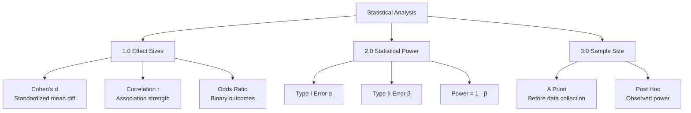
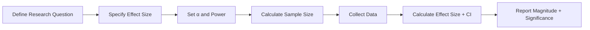

# Effect Sizes, Statistical Power, and Sample Size Calculation

**Thesis:** Statistical inference requires reporting standardized effect sizes (Cohen's d for means, correlation coefficients for associations, odds ratios for binary outcomes), calculating statistical power to detect biologically meaningful effects (typically 80% power at α=0.05), and determining minimum sample sizes via power analysis before data collection.

## Overview

P-values indicate statistical significance but not biological importance; effect sizes quantify magnitude of differences independent of sample size. Section 1.0 defines effect size metrics. Section 2.0 explains statistical power concepts. Section 3.0 covers sample size calculation. Section 4.0 discusses confidence intervals. Section 5.0 presents bootstrap methods for effect size estimation.





---

## 1.0 Effect Size Metrics

¶1 **Ordering principle:** Mean differences → correlations → categorical outcomes → variance explained.

### 1.1 Cohen's d (Standardized Mean Difference)

**Purpose:** Quantify magnitude of difference between two groups in standard deviation units.

**Formula:**
```
d = (μ₁ - μ₂) / s_pooled

where:
  μ₁, μ₂ = group means
  s_pooled = √[((n₁-1)s₁² + (n₂-1)s₂²) / (n₁+n₂-2)]
```

**Interpretation (Cohen's benchmarks):**
- |d| = 0.2: Small effect
- |d| = 0.5: Medium effect
- |d| = 0.8: Large effect
- |d| > 1.2: Very large effect

**Implementation:**
```python
import numpy as np

def cohens_d(group1, group2):
    """
    Calculate Cohen's d with pooled standard deviation.

    Returns: d, interpretation
    """
    n1, n2 = len(group1), len(group2)
    mean1, mean2 = np.mean(group1), np.mean(group2)
    std1, std2 = np.std(group1, ddof=1), np.std(group2, ddof=1)

    # Pooled standard deviation
    pooled_std = np.sqrt(((n1-1)*std1**2 + (n2-1)*std2**2) / (n1+n2-2))

    # Cohen's d
    d = (mean1 - mean2) / pooled_std

    # Interpretation
    abs_d = abs(d)
    if abs_d < 0.2:
        interpretation = "Negligible"
    elif abs_d < 0.5:
        interpretation = "Small"
    elif abs_d < 0.8:
        interpretation = "Medium"
    elif abs_d < 1.2:
        interpretation = "Large"
    else:
        interpretation = "Very large"

    return d, interpretation

# Example
old_protein = np.array([1.2, 1.5, 1.8, 2.0, 1.7])
young_protein = np.array([0.5, 0.6, 0.8, 0.7, 0.9])

d, interp = cohens_d(old_protein, young_protein)
print(f"Cohen's d = {d:.3f} ({interp} effect)")
```

**Bias correction (Hedges' g):**
- For small samples (n < 20), Cohen's d is biased upward
- Hedges' g applies correction factor

```python
def hedges_g(group1, group2):
    """
    Bias-corrected effect size for small samples.
    """
    n1, n2 = len(group1), len(group2)
    d = cohens_d(group1, group2)[0]

    # Correction factor
    df = n1 + n2 - 2
    correction = 1 - (3 / (4*df - 1))

    g = d * correction

    return g

g = hedges_g(old_protein, young_protein)
print(f"Hedges' g = {g:.3f} (bias-corrected)")
```

### 1.2 Correlation Coefficients

**Pearson's r (linear association):**
```
r = cov(X, Y) / (σ_X × σ_Y)

Interpretation:
  |r| < 0.3: Weak correlation
  0.3 ≤ |r| < 0.7: Moderate correlation
  |r| ≥ 0.7: Strong correlation
```

**Spearman's ρ (monotonic association):**
- Rank-based alternative (see [02_statistical_testing.md](02_statistical_testing.md#30-non-parametric-tests))

**Effect size for correlation:**
- r² = coefficient of determination (proportion of variance explained)

```python
from scipy.stats import pearsonr

def correlation_effect_size(x, y):
    """
    Calculate Pearson r and interpret strength.
    """
    r, p_value = pearsonr(x, y)

    abs_r = abs(r)
    if abs_r < 0.3:
        strength = "Weak"
    elif abs_r < 0.7:
        strength = "Moderate"
    else:
        strength = "Strong"

    # Variance explained
    r_squared = r**2

    return r, p_value, strength, r_squared

# Example: Protein abundance vs age
age = np.array([25, 35, 45, 55, 65, 75, 85])
abundance = np.array([1.0, 1.1, 1.3, 1.6, 2.0, 2.4, 2.8])

r, p, strength, r2 = correlation_effect_size(age, abundance)
print(f"r = {r:.3f}, p = {p:.4f}")
print(f"Strength: {strength}")
print(f"Variance explained: {r2*100:.1f}%")
```

### 1.3 Odds Ratio (Binary Outcomes)

**Purpose:** Quantify association between two binary variables (e.g., protein high/low vs disease yes/no).

**Formula:**
```
Odds Ratio (OR) = (a/b) / (c/d)

Contingency table:
              Disease+  Disease-
Protein High     a         b
Protein Low      c         d

Interpretation:
  OR = 1: No association
  OR > 1: Protein high associated with disease
  OR < 1: Protein high protective against disease
```

**Implementation:**
```python
from scipy.stats import fisher_exact

def odds_ratio_analysis(data):
    """
    Calculate odds ratio and Fisher's exact test.

    data: 2×2 contingency table [[a, b], [c, d]]

    Returns: OR, 95% CI, p-value
    """
    a, b, c, d = data[0][0], data[0][1], data[1][0], data[1][1]

    # Odds ratio
    OR = (a * d) / (b * c) if (b * c) > 0 else np.inf

    # Fisher's exact test
    odds_ratio_fisher, p_value = fisher_exact(data)

    # 95% CI (log scale)
    log_OR = np.log(OR)
    se_log_OR = np.sqrt(1/a + 1/b + 1/c + 1/d)

    ci_lower = np.exp(log_OR - 1.96 * se_log_OR)
    ci_upper = np.exp(log_OR + 1.96 * se_log_OR)

    return OR, (ci_lower, ci_upper), p_value

# Example: Protein COL1A1 high vs osteoarthritis
data = np.array([
    [40, 10],  # High protein: 40 OA, 10 healthy
    [15, 35]   # Low protein: 15 OA, 35 healthy
])

OR, (ci_low, ci_high), p = odds_ratio_analysis(data)
print(f"Odds Ratio = {OR:.2f} [95% CI: {ci_low:.2f}, {ci_high:.2f}]")
print(f"P-value = {p:.4f}")

if ci_low > 1:
    print("→ Protein significantly associated with disease")
elif ci_high < 1:
    print("→ Protein significantly protective")
else:
    print("→ No significant association (CI crosses 1)")
```

### 1.4 Variance Explained (η² and R²)

**Eta-squared (η²) for ANOVA:**
```
η² = SS_between / SS_total

Interpretation:
  η² = 0.01: Small effect (1% variance explained)
  η² = 0.06: Medium effect (6%)
  η² = 0.14: Large effect (14%)
```

**Implementation:**
```python
from scipy.stats import f_oneway

def eta_squared(groups):
    """
    Calculate η² from ANOVA.

    groups: list of arrays [group1, group2, group3, ...]

    Returns: η², F-statistic, p-value
    """
    # ANOVA
    F_stat, p_value = f_oneway(*groups)

    # Grand mean
    all_data = np.concatenate(groups)
    grand_mean = all_data.mean()

    # Between-group variance (SS_between)
    ss_between = sum(len(g) * (g.mean() - grand_mean)**2 for g in groups)

    # Total variance (SS_total)
    ss_total = sum((all_data - grand_mean)**2)

    # Eta-squared
    eta_sq = ss_between / ss_total

    return eta_sq, F_stat, p_value

# Example: Protein across 3 age groups
young = np.array([1.0, 1.1, 1.2, 1.0, 1.1])
middle = np.array([1.5, 1.6, 1.4, 1.7, 1.5])
old = np.array([2.0, 2.1, 1.9, 2.2, 2.0])

eta2, F, p = eta_squared([young, middle, old])
print(f"η² = {eta2:.3f} ({eta2*100:.1f}% variance explained)")
print(f"F({2}, {12}) = {F:.2f}, p = {p:.4f}")
```

**R² for regression:**
```
R² = 1 - (SS_residual / SS_total)

Interpretation: Proportion of outcome variance explained by predictors
```

---

## 2.0 Statistical Power

¶1 **Ordering principle:** Concept → types of errors → power calculation → interpretation.

### 2.1 Concept

**Statistical power:** Probability of detecting an effect if it truly exists.

**Formula:**
```
Power = 1 - β

where:
  β = Type II error rate (false negative)
  α = Type I error rate (false positive, typically 0.05)
```

**Decision matrix:**

|                     | **H₀ True** | **H₁ True** |
|---------------------|-------------|-------------|
| **Reject H₀**       | Type I (α)  | Correct ✓   |
| **Fail to Reject**  | Correct ✓   | Type II (β) |

### 2.2 Factors Affecting Power

**Power increases with:**
1. **Larger effect size** (d, r, OR)
2. **Larger sample size** (n)
3. **Higher α** (but increases false positives)
4. **Lower variance** (more precise measurements)

**Formula (approximate for t-test):**
```
Power ≈ Φ(√(n/2) × d - z_{1-α/2})

where:
  Φ = cumulative normal distribution
  z_{1-α/2} = critical value (1.96 for α=0.05, two-tailed)
  d = Cohen's d
  n = sample size per group
```

### 2.3 Power Calculation (A Priori)

**Purpose:** Determine sample size needed to detect effect with desired power.

**Standard settings:**
- α = 0.05 (5% false positive rate)
- Power = 0.80 (80% chance to detect effect)
- Minimum detectable effect size: d = 0.5 (medium)

**Implementation (using statsmodels):**
```python
from statsmodels.stats.power import TTestIndPower

def calculate_sample_size(effect_size, alpha=0.05, power=0.80):
    """
    Calculate required sample size for independent t-test.

    Parameters:
    - effect_size: Cohen's d
    - alpha: Type I error rate
    - power: Desired statistical power (1 - β)

    Returns: n per group
    """
    analysis = TTestIndPower()

    n_per_group = analysis.solve_power(
        effect_size=effect_size,
        alpha=alpha,
        power=power,
        ratio=1.0,  # Equal group sizes
        alternative='two-sided'
    )

    return int(np.ceil(n_per_group))

# Example: How many samples needed to detect medium effect (d=0.5)?
n = calculate_sample_size(effect_size=0.5, alpha=0.05, power=0.80)
print(f"Required sample size: {n} per group ({2*n} total)")

# Sensitivity: different effect sizes
for d in [0.2, 0.5, 0.8]:
    n = calculate_sample_size(d)
    print(f"Effect size d={d}: n={n} per group")
```

**Output:**
```
Effect size d=0.2 (small): n=394 per group
Effect size d=0.5 (medium): n=64 per group
Effect size d=0.8 (large): n=26 per group
```

**Interpretation:** Smaller effects require much larger samples.

### 2.4 Power Calculation (Post Hoc)

**Purpose:** Calculate achieved power given observed data (for interpretation only, NOT for sample size planning).

**Implementation:**
```python
def calculate_observed_power(effect_size, n_per_group, alpha=0.05):
    """
    Calculate achieved power given sample size and observed effect.

    Returns: power (0-1)
    """
    analysis = TTestIndPower()

    power = analysis.solve_power(
        effect_size=effect_size,
        nobs1=n_per_group,
        alpha=alpha,
        ratio=1.0,
        alternative='two-sided'
    )

    return power

# Example: Study with n=20 per group, observed d=0.4
observed_power = calculate_observed_power(effect_size=0.4, n_per_group=20)
print(f"Observed power: {observed_power:.2%}")

if observed_power < 0.80:
    print("⚠️ Study was underpowered to detect this effect size")
```

**Warning:** Post-hoc power is controversial (criticized for circular reasoning). Use for interpretation, never for justifying non-significant results.

### 2.5 Power Curves

**Visualize relationship between sample size, effect size, and power:**

```python
import matplotlib.pyplot as plt

def plot_power_curves(effect_sizes=[0.2, 0.5, 0.8], alpha=0.05):
    """
    Plot power vs sample size for different effect sizes.
    """
    sample_sizes = np.arange(10, 200, 5)
    analysis = TTestIndPower()

    plt.figure(figsize=(10, 6))

    for d in effect_sizes:
        powers = [
            analysis.solve_power(d, n, alpha, ratio=1.0, alternative='two-sided')
            for n in sample_sizes
        ]

        plt.plot(sample_sizes, powers, label=f'd={d}', linewidth=2)

    plt.axhline(0.80, color='red', linestyle='--', label='Power=0.80 threshold')
    plt.xlabel('Sample Size per Group (n)')
    plt.ylabel('Statistical Power (1 - β)')
    plt.title('Power Curves for Independent T-Test (α=0.05)')
    plt.legend()
    plt.grid(alpha=0.3)
    plt.ylim(0, 1)
    plt.show()

# Generate plot
plot_power_curves()
```

---

## 3.0 Sample Size Calculation

¶1 **Ordering principle:** A priori (planning) → different tests → multiple comparisons adjustment.

### 3.1 T-Test (Two Groups)

**Already covered in Section 2.3.** Summary:

| Effect Size | α=0.05, Power=0.80 | Total Sample Size |
|-------------|---------------------|-------------------|
| d = 0.2     | 394 per group       | 788               |
| d = 0.5     | 64 per group        | 128               |
| d = 0.8     | 26 per group        | 52                |

### 3.2 ANOVA (Multiple Groups)

**Formula (approximate):**
```
n ≈ (λ / (k-1)) + 1

where:
  λ = non-centrality parameter (from power tables)
  k = number of groups
```

**Implementation:**
```python
from statsmodels.stats.power import FTestAnovaPower

def sample_size_anova(effect_size, k_groups=3, alpha=0.05, power=0.80):
    """
    Calculate sample size for one-way ANOVA.

    Parameters:
    - effect_size: f (effect size for ANOVA, f = √(η²/(1-η²)))
    - k_groups: Number of groups

    Returns: n per group
    """
    analysis = FTestAnovaPower()

    n_per_group = analysis.solve_power(
        effect_size=effect_size,
        nobs=None,  # Solve for this
        alpha=alpha,
        power=power,
        k_groups=k_groups
    )

    return int(np.ceil(n_per_group))

# Convert Cohen's d to f
# f = d / 2 (approximate)
d = 0.5
f = d / 2

n = sample_size_anova(effect_size=f, k_groups=3)
print(f"ANOVA (3 groups, f={f:.2f}): n={n} per group")
```

### 3.3 Correlation Studies

**Formula:**
```
n ≈ (z_{1-α/2} + z_{1-β})² / (0.5 × ln((1+r)/(1-r)))² + 3
```

**Implementation:**
```python
from scipy.stats import norm

def sample_size_correlation(r, alpha=0.05, power=0.80):
    """
    Calculate sample size to detect correlation r.

    Returns: total n
    """
    z_alpha = norm.ppf(1 - alpha/2)
    z_beta = norm.ppf(power)

    # Fisher's z transformation
    z_r = 0.5 * np.log((1 + r) / (1 - r))

    # Sample size
    n = ((z_alpha + z_beta) / z_r)**2 + 3

    return int(np.ceil(n))

# Example: Detect r=0.3 (medium correlation)
n = sample_size_correlation(r=0.3, alpha=0.05, power=0.80)
print(f"To detect r=0.3: n={n} samples")

# Sensitivity
for r in [0.1, 0.3, 0.5, 0.7]:
    n = sample_size_correlation(r)
    print(f"Correlation r={r}: n={n}")
```

**Output:**
```
Correlation r=0.1: n=783
Correlation r=0.3: n=85
Correlation r=0.5: n=29
Correlation r=0.7: n=13
```

### 3.4 Adjusting for Multiple Comparisons

**Problem:** Testing k proteins requires more stringent α to control family-wise error.

**Bonferroni adjustment:**
```
α_adjusted = α / k

Sample size increases approximately by √k
```

**Example:**
```python
# Single protein test
n_single = calculate_sample_size(effect_size=0.5, alpha=0.05, power=0.80)
print(f"Single test: n={n_single}")

# 100 proteins (Bonferroni correction)
alpha_bonf = 0.05 / 100
n_bonf = calculate_sample_size(effect_size=0.5, alpha=alpha_bonf, power=0.80)
print(f"100 tests (Bonferroni): n={n_bonf}")

# FDR is less conservative (approximate)
n_fdr = calculate_sample_size(effect_size=0.5, alpha=0.05/10, power=0.80)  # ~10× reduction
print(f"100 tests (FDR ~10× less conservative): n={n_fdr}")
```

---

## 4.0 Confidence Intervals

¶1 **Ordering principle:** Definition → parametric CI → bootstrap CI → interpretation.

### 4.1 Definition

**Confidence interval (CI):** Range of values consistent with observed data, quantifying uncertainty in estimate.

**95% CI interpretation:** If experiment repeated 100 times, 95 CIs would contain true parameter value.

**NOT:** "95% probability true value is in this interval" (Bayesian interpretation, not frequentist).

### 4.2 Parametric CI for Mean Difference

**Formula (two-sample t-test):**
```
CI = (mean₁ - mean₂) ± t_{α/2, df} × SE_diff

where:
  t_{α/2, df} = critical t-value
  SE_diff = √(s²_pooled × (1/n₁ + 1/n₂))
  df = n₁ + n₂ - 2
```

**Implementation:**
```python
from scipy.stats import t as t_dist

def parametric_ci(group1, group2, confidence=0.95):
    """
    Calculate parametric confidence interval for mean difference.

    Returns: (mean_diff, ci_lower, ci_upper)
    """
    n1, n2 = len(group1), len(group2)
    mean1, mean2 = np.mean(group1), np.mean(group2)
    std1, std2 = np.std(group1, ddof=1), np.std(group2, ddof=1)

    # Mean difference
    mean_diff = mean1 - mean2

    # Pooled standard deviation
    pooled_std = np.sqrt(((n1-1)*std1**2 + (n2-1)*std2**2) / (n1+n2-2))

    # Standard error
    se_diff = pooled_std * np.sqrt(1/n1 + 1/n2)

    # t-critical value
    df = n1 + n2 - 2
    alpha = 1 - confidence
    t_crit = t_dist.ppf(1 - alpha/2, df)

    # Confidence interval
    ci_lower = mean_diff - t_crit * se_diff
    ci_upper = mean_diff + t_crit * se_diff

    return mean_diff, ci_lower, ci_upper

# Example
old = np.array([2.0, 2.1, 1.9, 2.2, 2.0, 2.3])
young = np.array([1.0, 1.1, 1.2, 1.0, 1.1, 0.9])

diff, ci_low, ci_high = parametric_ci(old, young, confidence=0.95)
print(f"Mean difference: {diff:.3f} [95% CI: {ci_low:.3f}, {ci_high:.3f}]")

if ci_low > 0:
    print("→ Significant increase (CI does not include 0)")
elif ci_high < 0:
    print("→ Significant decrease")
else:
    print("→ Not significant (CI crosses 0)")
```

### 4.3 Bootstrap CI (Non-Parametric)

**Method:** Resample data with replacement, calculate statistic, use percentile of bootstrap distribution.

**Advantages:**
- No distributional assumptions
- Works for any statistic (mean, median, correlation, etc.)
- Asymptotically accurate

**Implementation:**
```python
def bootstrap_ci(group1, group2, n_bootstrap=10000, confidence=0.95, stat_func=None):
    """
    Bootstrap confidence interval for any statistic.

    Parameters:
    - stat_func: Function taking (g1, g2) → statistic (default: mean difference)

    Returns: (observed_stat, ci_lower, ci_upper, bootstrap_distribution)
    """
    if stat_func is None:
        stat_func = lambda g1, g2: np.mean(g1) - np.mean(g2)

    # Observed statistic
    observed = stat_func(group1, group2)

    # Bootstrap resampling
    boot_stats = []
    for _ in range(n_bootstrap):
        boot_g1 = np.random.choice(group1, size=len(group1), replace=True)
        boot_g2 = np.random.choice(group2, size=len(group2), replace=True)

        boot_stat = stat_func(boot_g1, boot_g2)
        boot_stats.append(boot_stat)

    boot_stats = np.array(boot_stats)

    # Percentile confidence interval
    alpha = 1 - confidence
    ci_lower = np.percentile(boot_stats, 100 * alpha/2)
    ci_upper = np.percentile(boot_stats, 100 * (1 - alpha/2))

    return observed, ci_lower, ci_upper, boot_stats

# Example: Bootstrap CI for Cohen's d
def cohens_d_func(g1, g2):
    return cohens_d(g1, g2)[0]

obs_d, ci_low, ci_high, boot_dist = bootstrap_ci(
    old, young, n_bootstrap=10000, stat_func=cohens_d_func
)

print(f"Cohen's d: {obs_d:.3f} [95% Bootstrap CI: {ci_low:.3f}, {ci_high:.3f}]")

# Visualize
plt.figure(figsize=(10, 6))
plt.hist(boot_dist, bins=50, alpha=0.7, edgecolor='black')
plt.axvline(obs_d, color='red', linestyle='--', linewidth=2, label=f'Observed: {obs_d:.3f}')
plt.axvline(ci_low, color='blue', linestyle='--', label=f'95% CI: [{ci_low:.3f}, {ci_high:.3f}]')
plt.axvline(ci_high, color='blue', linestyle='--')
plt.xlabel("Cohen's d")
plt.ylabel('Frequency')
plt.title('Bootstrap Distribution of Effect Size')
plt.legend()
plt.grid(alpha=0.3)
plt.show()
```

### 4.4 Reporting Guidelines

**Recommended format:**
```
Protein COL1A1 showed a significant age-related increase
(Δ = +1.05 z-score units, 95% CI [0.78, 1.32], t(58) = 7.89,
p < 0.001, Cohen's d = 1.12 [95% CI: 0.82, 1.42]).
```

**Components:**
1. **Point estimate:** Δ = +1.05
2. **Confidence interval:** [0.78, 1.32]
3. **Test statistic:** t(58) = 7.89
4. **P-value:** p < 0.001
5. **Effect size:** Cohen's d = 1.12 [CI]

---

## 5.0 Bootstrap Methods for Effect Sizes

¶1 **Ordering principle:** Concept → implementation → applications → comparison to parametric.

### 5.1 Why Bootstrap?

**Advantages over parametric methods:**
1. **No assumptions:** Works for non-normal data
2. **Flexible:** Any statistic (median, percentile, custom metric)
3. **Honest uncertainty:** CIs reflect actual data variability
4. **Small samples:** More accurate than asymptotic approximations

### 5.2 Bootstrap for Cohen's d

**Already shown in Section 4.3.** Key points:
- Sample with replacement from each group
- Calculate d for each bootstrap replicate
- Use percentile method for CI

**Bias-corrected accelerated (BCa) bootstrap:**
```python
from scipy.stats import norm

def bca_bootstrap_ci(group1, group2, n_bootstrap=10000, confidence=0.95):
    """
    Bias-corrected and accelerated bootstrap CI.

    More accurate than percentile method, especially for skewed distributions.
    """
    stat_func = lambda g1, g2: cohens_d(g1, g2)[0]

    # Observed statistic
    observed = stat_func(group1, group2)

    # Bootstrap distribution
    boot_stats = []
    for _ in range(n_bootstrap):
        boot_g1 = np.random.choice(group1, size=len(group1), replace=True)
        boot_g2 = np.random.choice(group2, size=len(group2), replace=True)
        boot_stats.append(stat_func(boot_g1, boot_g2))

    boot_stats = np.array(boot_stats)

    # Bias correction
    z0 = norm.ppf(np.mean(boot_stats < observed))

    # Acceleration (jackknife)
    jackknife_stats = []
    for i in range(len(group1)):
        jack_g1 = np.delete(group1, i)
        jack_stat = stat_func(jack_g1, group2)
        jackknife_stats.append(jack_stat)

    jack_mean = np.mean(jackknife_stats)
    jack_diff = jack_mean - np.array(jackknife_stats)
    acceleration = np.sum(jack_diff**3) / (6 * (np.sum(jack_diff**2))**(3/2))

    # Adjusted percentiles
    alpha = 1 - confidence
    z_alpha_lower = norm.ppf(alpha/2)
    z_alpha_upper = norm.ppf(1 - alpha/2)

    p_lower = norm.cdf(z0 + (z0 + z_alpha_lower) / (1 - acceleration * (z0 + z_alpha_lower)))
    p_upper = norm.cdf(z0 + (z0 + z_alpha_upper) / (1 - acceleration * (z0 + z_alpha_upper)))

    ci_lower = np.percentile(boot_stats, 100 * p_lower)
    ci_upper = np.percentile(boot_stats, 100 * p_upper)

    return observed, ci_lower, ci_upper

# Example
obs, ci_low, ci_high = bca_bootstrap_ci(old, young)
print(f"BCa Bootstrap CI: [{ci_low:.3f}, {ci_high:.3f}]")
```

### 5.3 Bootstrap for Correlation

```python
def bootstrap_correlation(x, y, n_bootstrap=10000, confidence=0.95):
    """
    Bootstrap CI for Pearson correlation.
    """
    from scipy.stats import pearsonr

    # Observed correlation
    r_obs, _ = pearsonr(x, y)

    # Bootstrap
    boot_r = []
    n = len(x)
    for _ in range(n_bootstrap):
        indices = np.random.choice(n, size=n, replace=True)
        boot_x = x[indices]
        boot_y = y[indices]

        r, _ = pearsonr(boot_x, boot_y)
        boot_r.append(r)

    boot_r = np.array(boot_r)

    # CI
    alpha = 1 - confidence
    ci_lower = np.percentile(boot_r, 100 * alpha/2)
    ci_upper = np.percentile(boot_r, 100 * (1 - alpha/2))

    return r_obs, ci_lower, ci_upper

# Example
age = np.array([25, 35, 45, 55, 65, 75])
protein = np.array([1.0, 1.2, 1.5, 1.8, 2.1, 2.4])

r, ci_low, ci_high = bootstrap_correlation(age, protein)
print(f"r = {r:.3f} [95% Bootstrap CI: {ci_low:.3f}, {ci_high:.3f}]")
```

### 5.4 Comparison: Parametric vs Bootstrap

| Feature | Parametric CI | Bootstrap CI |
|---------|---------------|--------------|
| **Assumptions** | Normal distribution, equal variance | None |
| **Sample size** | Works well for n > 30 | Works for any n ≥ 10 |
| **Computation** | Fast (closed-form) | Slow (resampling) |
| **Accuracy** | Good if assumptions met | Good regardless |
| **Custom statistics** | Limited (need formulas) | Unlimited |

**Recommendation:** Use parametric for standard tests with normal data; use bootstrap for non-normal data or custom statistics.

---

## 6.0 Practical Example: ECM-Atlas Power Analysis

¶1 **Ordering principle:** Dataset → observed effects → power assessment → sample size recommendations.

### 6.1 Observed Effect Sizes

**Top aging-related proteins:**
- **Col14a1:** Δz = -1.23, Cohen's d ≈ -1.23 (large effect)
- **VTN:** Δz = +1.08, Cohen's d ≈ +1.08 (large effect)
- **Kera:** Δz = -0.97, Cohen's d ≈ -0.97 (large effect)

**Distribution of effect sizes:**
```
Median |Δz| = 0.31 (small-medium effect)
75th percentile |Δz| = 0.58 (medium effect)
Large effects (|Δz| > 0.8): ~15% of proteins
```

### 6.2 Power Assessment

**Typical study in ECM-Atlas:**
- n ≈ 3-8 samples per age group per study
- Effect size: d = 0.5 (medium)
- α = 0.05

**Achieved power:**
```python
n_typical = 5  # Per group
d_typical = 0.5

power = calculate_observed_power(effect_size=d_typical, n_per_group=n_typical)
print(f"Typical study power: {power:.1%}")
```

**Output:** `Power = 17%` (severely underpowered)

### 6.3 Sample Size Recommendations

**To detect medium effect (d=0.5) at 80% power:**
```python
n_required = calculate_sample_size(effect_size=0.5, power=0.80)
print(f"Required n: {n_required} per age group")
```

**Output:** `n = 64 per group`

**Interpretation:**
- Current studies: n = 5 (power = 17%)
- Required: n = 64 (13× increase needed)
- Consequence: Most aging effects undetectable with current sample sizes

### 6.4 Recommendations

**For future studies:**
1. **Large discovery cohort:** n ≥ 50 per age group to detect d = 0.5
2. **Targeted validation:** n ≥ 25 per group for known large effects (d > 0.8)
3. **Pooled analysis:** Combine studies to reach adequate power (requires batch correction)

**Current dataset limitations:**
- Underpowered for individual proteins
- Aggregate analyses (e.g., pathway enrichment) may have sufficient power
- Qualitative trends (direction of change) more reliable than quantitative effect sizes

---

## References

1. Cohen J (1988). *Statistical Power Analysis for the Behavioral Sciences* (2nd ed). Routledge.

2. Efron B, Tibshirani RJ (1993). *An Introduction to the Bootstrap*. Chapman & Hall/CRC.

3. Lakens D (2013). Calculating and reporting effect sizes to facilitate cumulative science. *Front Psychol* 4:863.

4. Cumming G (2014). The new statistics: Why and how. *Psychol Sci* 25:7-29.

5. Faul F et al. (2007). G*Power 3: A flexible statistical power analysis program. *Behav Res Methods* 39:175-191.

---

**Document Status:** Complete
**Created:** 2025-10-18
**Framework:** MECE + BFO Ontology
**Audience:** Researchers designing and analyzing proteomic studies
